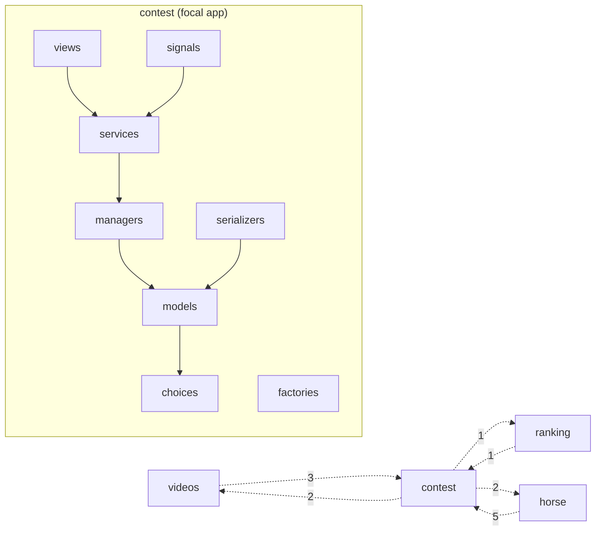
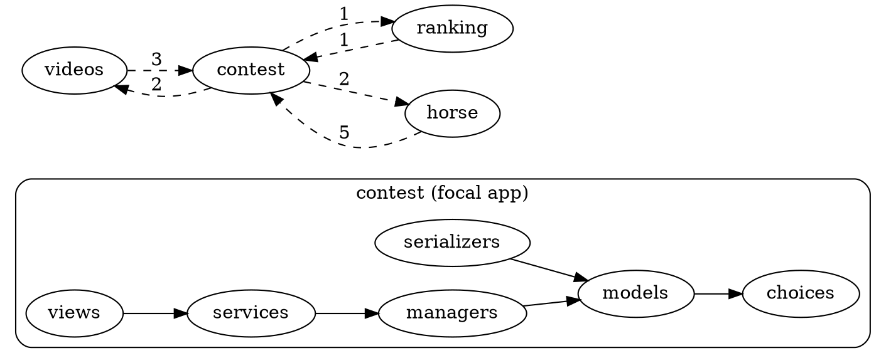

# Proposal: `app-graph` command

Status: **draft**
Target version: **0.4.0** (additive, no breaking changes from 0.3.0)

## Motivación

Permitir visualizar la arquitectura de una **app concreta** dentro de un
proyecto Django/Python multi-app, con dos niveles de detalle:

- **Detalle interno**: aristas módulo-a-módulo dentro de la app focal
  (`contest.models → contest.choices`, `contest.serializers →
  contest.models`, etc.).
- **Resumen externo agregado**: aristas hacia/desde otras apps con
  contador y ambas direcciones cuando existan
  (`contest →3→ videos`, `videos →1→ contest`).

Es un grafo *doughnut*: detallado en el centro, agregado en el anillo
exterior.

### ¿Por qué no es suficiente con lo que hay?

| Comando existente | Por qué no cubre este caso |
|---|---|
| `analyze` | Métricas globales del proyecto, no enfoque por app. |
| `focus-graph` | Diff entre dos refs de git. Otro propósito. |
| `contracts-graph` | Visualiza contratos lint-imports, no arquitectura interna. |

Falta un comando para **revisión arquitectónica de una app**: ver de un
vistazo qué pinta tiene por dentro y qué dependencias mantiene con el
resto del proyecto, sin saturarse con el grafo completo.

## CLI

```bash
grimp-tools app-graph <app> [options]
```

### Argumentos

| Flag | Default | Descripción |
|---|---|---|
| `<app>` (positional) | — | Nombre de la app focal. Debe estar en `[tool.importlinter] root_packages`. |
| `-o, --output FILE` | stdout | Ruta del fichero de salida. |
| `--format {mermaid,dot}` | `mermaid` | Formato de salida. |
| `--top N` | unlimited | Limita las apps externas mostradas a las top N por aristas totales (in + out). |
| `--no-internal` | false | Oculta el subgrafo interno (solo cross-app). |
| `--no-external` | false | Oculta las aristas cross-app (solo subgrafo interno). |
| `--strip-prefix` / `--no-strip-prefix` | strip on | Quita el prefijo `<app>.` de las etiquetas dentro del subgrafo (más legible). |

### Ejemplos

```bash
# Mermaid a stdout
grimp-tools app-graph contest

# Guardar a fichero
grimp-tools app-graph contest -o docs/graphs/contest.md

# DOT renderizado a SVG
grimp-tools app-graph contest --format dot | dot -Tsvg > contest.svg

# Limitar a las 5 apps externas más acopladas
grimp-tools app-graph dressage --top 5

# Solo vista interna (apps con muchas dependencias cross-app)
grimp-tools app-graph dressage --no-external
```

## Output esperado

### Mermaid



Convenciones:
- Aristas internas: continuas (`-->`).
- Aristas cross-app: punteadas (`-.->|N|`) con contador.
- IDs internos llevan prefijo `<app>_` para evitar colisión con etiquetas
  cross-app cuando la app aparece como nodo (p.ej. `contest`).

### DOT



## Algoritmo

```
1. Cargar root_packages de pyproject.toml (reusar config.load_root_packages).
2. Validar que <app> está en root_packages; si no, exit 1 con mensaje.
3. Construir grafo: build_graph(root_packages) (reusar graph.build_graph,
   que ya hace exclude_type_checking_imports=True).
4. Recorrer aristas:
   for src in graph.modules:
       if any(part in skip for part in src.split(".")): continue
       src_app = src.split(".")[0]
       if src_app not in root_packages: continue   # external lib
       for tgt in graph.find_modules_directly_imported_by(src):
           if any(part in skip for part in tgt.split(".")): continue
           tgt_app = tgt.split(".")[0]
           if tgt_app not in root_packages: continue   # external lib
           if src_app == app and tgt_app == app:
               internal_edges.add((src, tgt))
           elif src_app == app and tgt_app != app:
               external_out[tgt_app] += 1
           elif src_app != app and tgt_app == app:
               external_in[src_app] += 1
5. Aplicar --top: ordenar external por (in + out) desc, quedarse con top N.
6. Render según --format.
7. Escribir a --output o stdout.
```

### Filtrado y exclusiones

Reusar `get_skip_modules()` de `config.py` para excluir migrations,
admin, apps, management, etc. (consistente con el resto de comandos).

## Estructura del código

Siguiendo la convención del repo (cada comando = 1 fichero + función `run`):

```
src/grimp_tools/
├── app_graph.py        # NUEVO — implementación
├── cli.py              # MODIFICAR — añadir subparser
└── ...

tests/
└── test_app_graph.py   # NUEVO
```

### `app_graph.py` (esqueleto)

```python
"""Generate a doughnut graph for a single app: detailed internal edges
plus aggregated cross-app counts."""

from collections import defaultdict
from pathlib import Path
import sys

from grimp_tools.config import get_skip_modules, load_root_packages
from grimp_tools.graph import build_graph


def run(args) -> None:
    packages = load_root_packages()
    if args.app not in packages:
        sys.exit(
            f"App '{args.app}' not in root_packages. "
            f"Available: {', '.join(sorted(packages))}"
        )

    skip = get_skip_modules()
    graph = build_graph(packages)

    internal_edges, external_in, external_out = _collect_edges(
        graph, args.app, packages, skip
    )

    if args.top:
        external_in, external_out = _apply_top(
            external_in, external_out, args.top
        )

    if args.format == "mermaid":
        output = _render_mermaid(
            args.app,
            internal_edges if not args.no_internal else set(),
            external_in if not args.no_external else {},
            external_out if not args.no_external else {},
            strip_prefix=args.strip_prefix,
        )
    else:
        output = _render_dot(
            args.app,
            internal_edges if not args.no_internal else set(),
            external_in if not args.no_external else {},
            external_out if not args.no_external else {},
            strip_prefix=args.strip_prefix,
        )

    if args.output:
        Path(args.output).write_text(output)
    else:
        print(output)


def _collect_edges(graph, app, packages, skip):
    """Return (internal_edges, external_in, external_out)."""
    internal_edges: set[tuple[str, str]] = set()
    external_in: dict[str, int] = defaultdict(int)
    external_out: dict[str, int] = defaultdict(int)

    for src in graph.modules:
        if any(part in skip for part in src.split(".")):
            continue
        src_app = src.split(".")[0]
        if src_app not in packages:
            continue
        for tgt in graph.find_modules_directly_imported_by(src):
            if any(part in skip for part in tgt.split(".")):
                continue
            tgt_app = tgt.split(".")[0]
            if tgt_app not in packages:
                continue
            if src_app == app and tgt_app == app:
                internal_edges.add((src, tgt))
            elif src_app == app and tgt_app != app:
                external_out[tgt_app] += 1
            elif src_app != app and tgt_app == app:
                external_in[src_app] += 1

    return internal_edges, external_in, external_out


def _apply_top(external_in, external_out, top):
    combined: dict[str, int] = defaultdict(int)
    for app, n in external_in.items():
        combined[app] += n
    for app, n in external_out.items():
        combined[app] += n
    top_apps = sorted(combined, key=combined.get, reverse=True)[:top]
    top_set = set(top_apps)
    return (
        {a: n for a, n in external_in.items() if a in top_set},
        {a: n for a, n in external_out.items() if a in top_set},
    )


def _render_mermaid(app, internal, ext_in, ext_out, strip_prefix=True):
    ...  # construir string mermaid


def _render_dot(app, internal, ext_in, ext_out, strip_prefix=True):
    ...  # construir string dot
```

### `cli.py` — añadir subparser

```python
from grimp_tools.app_graph import run as run_app_graph

# ... en main(), tras contracts_graph_parser:

# app-graph
app_graph_parser = subparsers.add_parser(
    "app-graph",
    help="Doughnut graph for a single app: internal detail + cross-app counts",
)
app_graph_parser.add_argument(
    "app",
    help="Focal app (must be in root_packages)",
)
app_graph_parser.add_argument(
    "-o", "--output",
    help="Output file (default: stdout)",
)
app_graph_parser.add_argument(
    "--format",
    choices=["mermaid", "dot"],
    default="mermaid",
)
app_graph_parser.add_argument(
    "--top",
    type=int,
    default=None,
    help="Limit cross-app edges to top N apps by total edges (in + out)",
)
app_graph_parser.add_argument(
    "--no-internal",
    action="store_true",
    help="Hide internal subgraph",
)
app_graph_parser.add_argument(
    "--no-external",
    action="store_true",
    help="Hide cross-app edges",
)
app_graph_parser.add_argument(
    "--strip-prefix",
    action="store_true",
    default=True,
    help="Strip <app>. prefix from internal node labels (default: true)",
)
app_graph_parser.add_argument(
    "--no-strip-prefix",
    action="store_false",
    dest="strip_prefix",
    help="Keep full module path as label",
)

# ... en el dispatcher:
elif args.command == "app-graph":
    run_app_graph(args)
```

## Tests (`tests/test_app_graph.py`)

Casos a cubrir:

1. **App no existe en root_packages**: `sys.exit` con mensaje claro.
2. **Internal edges only**: app sin imports cross-app → solo subgrafo
   interno.
3. **Bidirectional cross-app**: app que importa de otra y es importada
   por ella → dos aristas en el render con contadores.
4. **`--top N`**: con más de N apps externas, verifica que solo aparecen
   las top N por aristas totales.
5. **`--no-internal`**: no aparece el subgrafo.
6. **`--no-external`**: no aparecen aristas externas.
7. **`--format dot`**: output sintácticamente válido (`digraph`,
   `subgraph cluster_*`, `[label="N", style=dashed]`).
8. **`--format mermaid`**: output sintácticamente válido (`graph LR`,
   `subgraph "..."`, `-.->|N|`).
9. **`--strip-prefix` / `--no-strip-prefix`**: etiquetas con o sin
   prefijo de app.
10. **`skip_modules`**: módulos en `skip` (migrations, admin, etc.) no
    aparecen ni como source ni como target.

Mockear `grimp.build_graph` con un grafo controlado, no usar fixtures de
proyectos reales (consistente con `test_analyze.py`,
`test_snapshot.py`).

## Documentación

### `README.md`

Añadir sección `## app-graph` con:
- Propósito (1 párrafo).
- 2-3 ejemplos de uso.
- Render Mermaid pequeño embebido.

### `BOOTSTRAP.md`

Añadir entradas en "CLI Entry Points":

```bash
grimp-tools app-graph contest                 # Doughnut graph (mermaid → stdout)
grimp-tools app-graph contest -o docs/graphs/contest.md
grimp-tools app-graph dressage --format dot --top 5
```

Y entradas en "Package Structure" para `app_graph.py` y
`test_app_graph.py`.

## Cuestiones abiertas

1. **Etiquetas con sub-módulos**: si `contest/services/report.py`
   existe, ¿se muestra como `services.report` (con `--strip-prefix`) o
   se sustituye `.` por `_` en el ID? Verificar que Mermaid acepta `.`
   en IDs entre comillas.
2. **Apps con sub-apps Django** (caso `sicab.result`, `sicab.program`):
   tratarlas como apps independientes si están como `root_packages`
   independientes; respetar lo que diga `pyproject.toml`.
3. **Apps muy conectadas internamente**: una app con muchos modelos
   (p.ej. 19) y muchos imports internos puede saturar el subgrafo.
   Considerar `--max-internal N` o un aviso si supera X aristas. No
   crítico para el primer release.
4. **Bulk mode**: `grimp-tools app-graph --all -o docs/graphs/` para
   generar todas las apps a la vez. Posible en una iteración posterior
   cuando se valide el formato.

## Versionado y release

Tras implementar:

1. Bump versión a **0.4.0** (additive, no breaking changes).
2. Tag `v0.4.0` (setuptools-scm lo lee del tag).
3. Push a PyPI.
4. Anuncio breve en README.

### En proyectos consumidores

Bump `grimp-tools>=0.4.0` y añadir target Makefile:

```makefile
app-graph:
	grimp-tools app-graph $(app) -o docs/graphs/$(app).md
```

Uso: `make app-graph app=contest`.

## Referencias

- Petición original viene del repo consumidor `concursos2` (~41 apps
  Django) como herramienta para revisión arquitectónica per-app.
  Documentado en su ADR de lint-imports como vía de visualización
  complementaria a `focus-graph` y `contracts-graph`.
